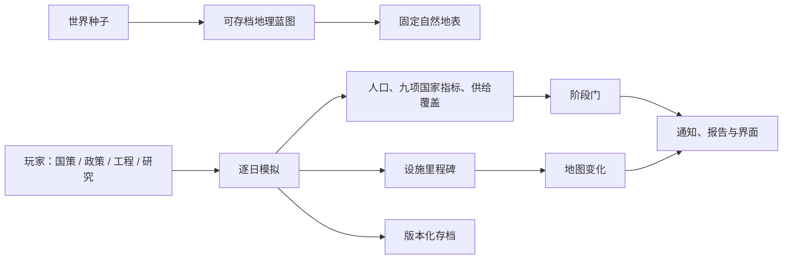

# Always Game：初期 Demo 底层框架基线

> 状态：**旧河谷测试夹具的**规则基线。它说明“当时由代码保证的事实”与“尚未进入试玩的目录或设想”，避免把未来内容误当成现有功能。
>
> 当前可玩范围：第 07 号深层存续设施的 31 名居民外拓翡翠河谷，从外拓维持走向河谷定居，再形成河谷工务镇。
>
> **重要更正（2026-08-16）：** 此处的地点、人数、工程、事件与阶段名均是 Legacy Valley Fixture 的样例，不是默认战役、世界硬设定或通用系统输入。所有后续实现以 `STANDARDIZATION_AND_SCENARIO_SEPARATION.md` 为准；本文件只保留为回归测试和历史参考。

## 1. 系统总览

玩家永远扮演统一政府的中央决策者。地方节点只反馈现场条件和执行结果；没有独立外交、军队、货币或退出权。游戏的基本单位是“方向—执行—反馈”，而不是居民逐格操作。

## 2. 地图与世界生成

| 规则 | 已确定的实现 |
|---|---|
| 世界来源 | 开局种子确定大陆、高程、山系、流域、气候、地貌模块和可建节点。相同种子重建相同世界。 |
| 自然地表 | 山脉、河谷、林地、海岸等在生成时冻结为世界坐标上的地表特征；缩放只改变取样精度，不会因镜头位置重新随机摆图。 |
| 存档内容 | 保存蓝图、地表特征、节点锚点和 `terrainChanges`；不保存整张位图。渲染缓存可随时重建。 |
| 工程反馈 | 仅工程达到 50% 试运行或 100% 投用后写入地图：净水干线形成水务走廊和聚居扩张，工务所形成道路与服务聚落，通信塔只形成自身地标。 |
| 聚居地 | 位置读取世界节点；发展阶段读取人口和实体工程；外观将来只读取当地气候、地貌和阶段，不绑定“河谷”剧情。 |
| 美术性能 | 当前 24 张地貌和少量设施资产走缓存合成。正式贴图生产必须按工程资产家族复用，不能按每项工程单独出图。 |

地图事实链是：**种子 → 蓝图 → 固定自然地表 → 工程存档增量 → 渲染**。任何 UI 面板或剧情文字都不能绕过这条链凭空改变地图。

## 3. 时间、模拟与挂机

| 规则 | 已确定的实现 |
|---|---|
| 最小时间单位 | 一天。所有工程、研究、人口、事件和政策均按日推进。 |
| 速度 | 暂停 / 1× / 2× / 4×；只有玩家手动暂停。报告、事件和里程碑不自动暂停时间。 |
| 运算边界 | `advanceOneDayV6` 是唯一日步入口；批量推进只循环调用它，因此可复现、可无界面测试。 |
| 调度惯性 | 切换国策进入 10 日交接，效率从 65% 逐步恢复。工程和研究切换有 3 日交接。 |
| 自动推进 | 工程和研究各有独立手动/自动开关。自动槽等待前置达成后会自行开始下一项；等待状态只提示一次，避免日志刷屏。 |
| 事件 | 当前为条件触发的非阻塞事件：会改变国家条件和通知，但不会把持续运行切成回合。事件系统尚未扩展为完整的事件链与选择后果库。 |

## 4. 数值与资源模型

### 4.1 玩家长期看到什么

主界面保留 **人口 + 九项国家指标**：日常保障、工务能力、可用能源、研究能力、统筹能力、运输与补给、防卫能力、共同体协作、土地与环境。

它们都是 0–100 的国家能力指数，不是会无限堆叠的物资数量。每项有基础水平，科技、设施、国策、政策、事件和供给状况共同形成一个“当前可维持水平”；实际值逐日向它平缓收敛。因此长期挂机不会在没有原因的情况下全部跌为 0 或涨到 100。

### 4.2 资源如何收束

- 聚居地阶段使用 LDU（本地日供给单位）：维持整个聚居地一天的需求 = 1。
- 水、食物、能源、维护显示为覆盖率和设施状态，而不是越玩越长的库存条。
- 滤芯、材料、种源、燃料等具体物资属于工程前置、事件原因或设施维护来源；它们改变核心指标的稳定水平、速度或风险。
- 形成国家后将切换为 NDU（国家日供给单位）：维持该国家一天的总需求 = 1。LDU→NDU 的换算规则尚未实装，但单位升级协议已冻结。

### 4.3 人口与阶段

人口只在水、食物、能源达到生活底线、民生合格且设施有余量时增长；保障崩溃时会流失。容量来自已投用的净水、温室、工务和通信设施。

| 阶段 | 触发条件 | 玩家意义 |
|---|---|---|
| 外拓维持 | 默认 | 优先解决水、食物和生活保障。 |
| 河谷定居成立 | 净水稳定、温室试运行、水食覆盖达标、民生 ≥55 | 脱离每日生存危机，可开始投入工务与外拓。 |
| 河谷工务镇 | 定居成立、渡口工务投用、人口 ≥50、物流 ≥35 | 中央开始承担区域调配与外拓成本。 |

## 5. 科技、工程、政策与国策

四类操作严格分层：

| 层级 | 玩家决定什么 | 典型结果 |
|---|---|---|
| 国策 | 长期资源倾向 | 民生优先、定居发展、工务恢复、科研攻关、边境警戒；切换有惯性。 |
| 当前政策 | 有期限的局部集中行动 | 配给、卫生、护运等；有冷却、对象和副作用。 |
| 工程 | 一次性建成的实体设施 | 管网、温室、渡口工务所、通信塔；有施工阶段和地图结果。 |
| 科研 | 可重复使用的能力验证 | 勘查、滤膜、田间恢复、维护、通信等；解锁工程、政策或下一项研究。 |

前置条件可以跨领域。工程的指标门槛只负责“能否开工”；工程一旦开工，不会因为当天的短期指标波动而无故停摆。知识和设施前置仍持续有效，未来加入损坏机制时可以真实造成停工。

当前实际可玩的纵切是 **8 项研究、4 项工程、4 项政策**。`content/r5/stage-1/` 中的 1,000 科技、1,000 工程、20 个政策家族是已验证的目录和前置图，尚未整体接入运行时选择器；这是下一阶段的内容接入工作，不是本 Demo 已实现的承诺。

## 6. 界面、文案与信息层级

| 层级 | 当前职责 |
|---|---|
| 地图 | 默认主画面，显示固定地形、节点、工程地表变化和三种信息图层。 |
| 顶栏 | 时间速度、人口与核心指标的快速状态。 |
| 左侧入口 / 底部命令 | 打开国家概览、国策、当前政策、工程、研究和报告；不做逐格建造。 |
| 事件日志 | 只记录开工、里程碑、完成、阶段变化、事件和等待前置等值得回看的信息。 |
| 文案 | 模拟内核只写稳定键与参数；玩家可见文本由文案层统一解释，不能由实现代码临时拼句。 |

## 7. 存档、版本与测试

- 当前战役版本为 `CampaignSaveV6`；旧 v1–v5 存档只备份，不猜测性转换旧进度。
- 旧 v6 存档会补齐必要的确定性字段，但不会重掷种子、重算世界或覆盖已发生的工程变化。
- “开始新的战役”会先归档当前 v6 原文，再建立新的元年世界；不会静默删除已有进度。
- 已有无界面模拟覆盖：持续时间、调度惯性、自动槽恢复、科技/工程里程碑、人口与阶段、工程地图变化、固定地表复现与存档迁移。

## 8. 初期 Demo 的验收边界

初期 Demo 已达到：

1. 新战役可理解地从 31 人外拓开始；
2. 玩家可手动或自动推进研究、工程，并在不停表的情况下改国策；
3. 水务与温室解除生存危机，人口和地图随设施真实变化；
4. 工业转向能打开渡口工务，随后形成河谷工务镇；
5. 同一世界种子、存档重载和长期模拟能复现关键事实。

它尚不是完整首阶段战役，更不是全球统一或太空阶段的 Demo。

## 9. 已记录、暂不在本轮平衡的事项

1. 顶栏需要改为更可读的多行核心指标布局，避免单字缩略；
2. 工程/科技面板需要从原型列表升级为分支图、筛选与明确的下一节点提示；
3. 当前事件仍偏少，缺少地方差异、人口流动、教育、宗教文化与外交的长期因果链；
4. LDU→NDU、区域预算、国家级军事能力和统一调配网络尚未进入运行时；
5. 正式贴图的缩放合成、性能预算与地图可读性仍需基于试玩截图继续优化；
6. 失败条件、离线推进、存档导入导出、无障碍与完整数值平衡尚未冻结。

这些属于后续体验与内容阶段；不能为了补齐它们破坏本文件已确定的事实链。
