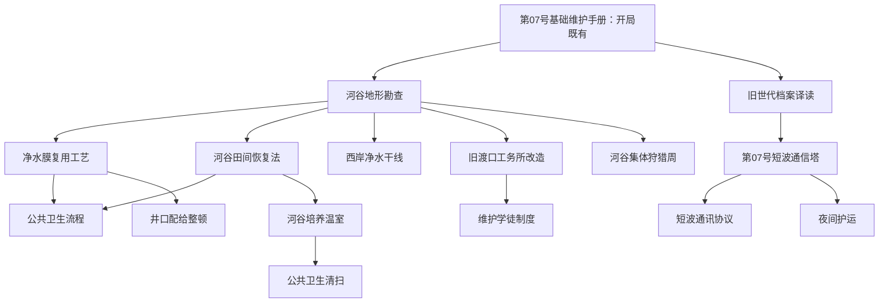

# P1-S03 R1A：内容与规则框架

> **状态**：Codex 冻结中；禁止据此直接实现。  
> **目的**：先确定“内容怎样成为规则”，再填写数值、事件正文与地图细节。  
> **不含**：最终平衡数值、事件叙事、UI 视觉、图片、音效、地图绘制。

## 1. 内容不是散落在代码里的条件判断

首局所有可玩内容分成两部分：

```text
作者数据（Codex 编写）                 运行状态（模拟内核计算）
科技、工程、当前政策、设施、地区  →  解锁、进度、设施阶段、影响、事件、通知
```

运行内核不得自行创造新内容、补全缺失前置、猜测数值或编写玩家文字；它只能读取已冻结的注册表并按统一规则结算。

## 2. 四种作者对象

| 对象 | 目的 | 是否可重复 | 是否有地图锚点 | 典型结果 |
|---|---|---:|---:|---|
| `TechDefinition` 科技 | 验证知识、方法或制度能力 | 否 | 可选，通常关联设施/地区 | 解锁工程、政策、后续科技、修正风险 |
| `ProjectDefinition` 工程 | 建造/改造一个实体设施 | 否 | 必须 | 设施阶段、永久指标修正、地图变化 |
| `PolicyDefinition` 当前政策 | 进行一次短期、局部集中行动 | 可重复但有冷却/条件 | 必须写地点或对象 | 临时指标/风险修正、政策结果通知 |
| `FacilityDefinition` 设施 | 地图上已存在或由工程建成的事实 | 不适用 | 必须 | 提供前置、持续效果、事件上下文、地图表现 |

国策不是作者对象卡池：它是固定的 5 项全局资源倾斜规则；只允许改变日速率、自动优先序和风险权重。

## 3. 统一前置系统

所有锁定条件只使用一个 `Requirement` 联合类型；不得在 UI、模拟或地图分别写不同条件。

```ts
type Requirement =
  | { kind: 'tech'; id: TechId }
  | { kind: 'facility'; id: FacilityId; stage: 'construction' | 'trial' | 'operational' }
  | { kind: 'metric'; id: MetricId; min: number }
  | { kind: 'region'; id: RegionId; state: RegionState }
  | { kind: 'project'; id: ProjectId; milestone: 25 | 50 | 75 | 100 };

interface RequirementSet {
  all: Requirement[];      // 必须全部满足
  any?: Requirement[];     // 若存在，则至少满足其中一项
}
```

显示层永远调用同一 `explainRequirement()`：

```text
满足：河谷地形勘查已投入使用
未满足：旧渡口工务所仍在施工；需要达到试运行
未满足：工业产能 27 / 30
```

## 4. 固定生命周期

### 4.1 科技与工程

```text
locked → available → active → milestone 25/50/75 → completed → archived
                         ↘ stalled ↗
```

- `locked`：前置不满足，不可选；
- `available`：前置满足，尚未选择；
- `active`：正在投入；
- `stalled`：前置在运行中失效或关键指标跌破维持线，保留进度并说明原因；
- `completed`：100% 时一次性结算效果并写入设施/科技状态；
- `archived`：完成后退出选择器，进入“已投入使用”档案；
- 自动推进只能从 `available` 项中选，绝不从 `locked`、`completed` 或 `stalled` 项中选。

### 4.2 当前政策

```text
locked → available → active(剩余天数) → resolved → cooldown → available
```

政策不是进度条、不是设施、不会进入工程档案。提前替换时进入 `cancelled`，并生成一条明确结果通知。

### 4.3 设施

```text
locked → planned → construction → trial → operational ↔ damaged
```

设施阶段由对应工程的节点推进，或由事件改变；地图、指标、科技前置、政策前置和事件权重都读取这个阶段。

## 5. 静态数据的最小字段

```ts
interface TechDefinition {
  id: TechId;
  name: string;
  summary: string;
  requirements: RequirementSet;
  researchProfile: ResearchProfileId;
  unlocks: UnlockEffect[];
  stages: MilestoneDefinition[];
}

interface ProjectDefinition {
  id: ProjectId;
  name: string;
  location: NodeId;
  facilityId: FacilityId;
  requirements: RequirementSet;
  workProfile: ProjectProfileId;
  builder: string;
  beneficiary: string;
  stages: MilestoneDefinition[];
  completion: CompletionEffect[];
}

interface PolicyDefinition {
  id: PolicyId;
  name: string;
  location: NodeId | RegionId;
  target: string;
  durationDays: number;
  requirements: RequirementSet;
  effects: TimedEffect[];
  completion: CompletionEffect[];
  cooldownDays: number;
}

interface FacilityDefinition {
  id: FacilityId;
  name: string;
  anchor: NodeId;
  source: 'starting' | ProjectId;
  stageEffects: Record<FacilityStage, FacilityEffect[]>;
  mapPresentation: Record<FacilityStage, MapPresentation>;
}
```

**作者责任**：上述每一个面向玩家的字符串、效果数值、阶段内容和地图描述均由 Codex 写入正式内容表。实现者不可添加后备文案、默认数值或“合理猜测”。

## 6. 效果分类：短期、长期、解锁必须分开

| 效果 | 来源 | 生命周期 | 可修改对象 |
|---|---|---|---|
| `TimedEffect` | 当前政策、事件 | 到期移除 | 指标日速率、项目速度、风险权重 |
| `FacilityEffect` | 工程里程碑、设施状态 | 直到设施受损/替换 | 指标日速率、风险权重、地区状态 |
| `UnlockEffect` | 科技完成、设施阶段 | 永久（除非世界状态撤销） | 解锁科技/工程/政策/制度 |
| `CompletionEffect` | 科研或工程 100% | 一次结算 + 可能附带永久效果 | 通知、设施状态、地图状态、指标 |

所有数值修正均进入一个 `ModifierResolver`；不可在每个事件里直接修改指标并遗失来源。玩家点击任何指标时必须能列出其当前修正来源。

## 7. 首局关系骨架（只冻结结构）



此图只定义“谁能解锁谁”。下一步 R1B 再为每个节点写：地点、阶段、数值、普通人后果、实际地图表现和准确玩家文本。

## 8. 运行状态边界

```ts
interface CampaignStateV6 {
  day: number;
  speed: 0 | 1 | 2 | 4;
  nationalPolicy: NationalPolicyState;
  currentPolicy: ActivePolicyState | null;
  projectSlot: SlotRuntime<ProjectId>;
  researchSlot: SlotRuntime<TechId>;
  completed: { techs: TechId[]; projects: ProjectId[] };
  facilities: Record<FacilityId, FacilityRuntime>;
  metrics: Record<MetricId, MetricValue>;
  regions: Record<RegionId, RegionRuntime>;
  notifications: Notification[];
}
```

不进入 `CampaignStateV6` 的内容：旧资源库存账、旧债务条、独立地图完成判断、UI 临时文本、任何未冻结的作者内容。

## 9. 日供给单位：控制长期数据膨胀

核心指标仍是 0–100 的国家状态；当系统需要表达产出、消耗、维护负担、工程吞吐或后勤能力时，使用**日供给单位**，而不是暴涨的吨、件、卡路里、人口或货币数。

### 9.1 聚居地阶段：本地日供给单位（`LDU`）

`1 LDU` = 在当前聚居地规模、技术水平和生活标准下，使该聚居地完整维持 **1 游戏日** 所需的综合供给基准。水、食物、能源、维修和基础服务可在内部有不同分项，但每项都以“覆盖本地一天需求的比例”表示。

```text
水网可用能力 1.15 LDU/日  → 当前可比聚居地日需多覆盖 15%
温室供给能力 0.72 LDU/日  → 尚需配给、采集或政策补足 28%
工程维护负担 0.18 LDU/日 → 占用本地生产/后勤的一部分
```

人口增长、伤病、生活标准提升会改变 `localDailyDemand`，但 UI 显示的是“供给覆盖率”和“余裕天数/风险”，不把真实单位膨胀成百万或十亿。

### 9.2 国家阶段：国家日供给单位（`NDU`）

进入国家阶段后，`1 NDU` = 维持该国家在当前人口、领土和公共服务标准下运行 **1 游戏日** 的总基准。地方设施仍可在自己的 `LDU` 中计算；国家层只看它们贡献给全国日需的比例。

```text
全国基础供给 1.08 NDU/日  → 有 8% 全国余裕
战略工业维护 0.14 NDU/日  → 占用全国日供给能力
北部干旱冲击 -0.06 NDU/日 → 扣的是全国覆盖率，不是几十亿单位粮食
```

### 9.3 阶段转换与可解释性

```ts
interface SupplyScale {
  era: 'settlement' | 'state' | 'planetary' | 'stellar';
  unit: 'LDU' | 'NDU' | 'PDU' | 'SDU';
  dailyDemand: number;       // 仅供内部比例计算
  previousScaleRatio?: number;
  label: string;             // 玩家语言，例如“河谷一天的完整供给”
}
```

阶段切换时不重新“送资源”：系统保存转换比例，保证设施、项目、事件前后的覆盖率和趋势连续。玩家只看到新的、更高层级日供给单位及其来源；仍可从报告回溯“哪些地区贡献了这一天的供给”。

具体物资（滤芯、菌种、轴承、燃料、药品）永远不恢复成长期大库存；它们作为设施故障、工程前置、贸易条件和事件原因，影响 `LDU/NDU` 的供给率、恢复速度或风险。

## 10. R1A 完成条件

- 任何科技、工程、政策都可从 ID 追溯到前置、效果、地点与生命周期；
- 任何设施阶段能同时解释地图、指标、事件和解锁；
- 工程与科研的手动/自动分支没有歧义；
- 所有可由实现者“猜出来”的部分明确标为 Codex 待填数据；
- 不创建代码任务、不制作视觉、不委托 DeepSeek。
