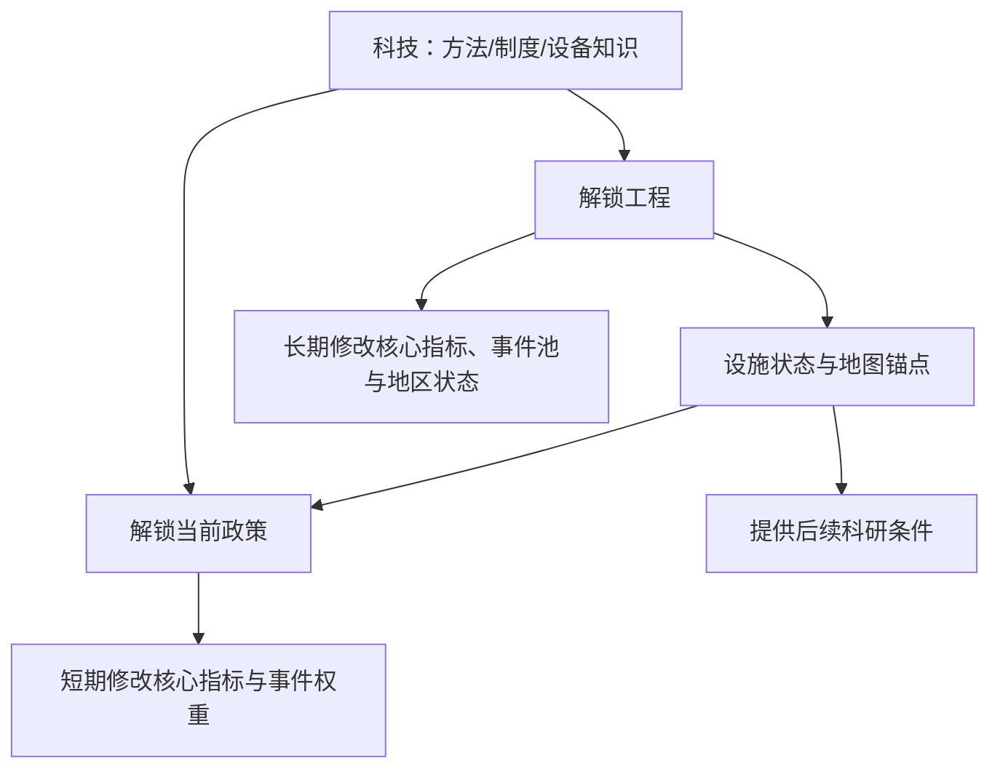

# P1-S03 重构总计划：从连续数值原型到可玩的河谷国家经营

> **状态**：等待用户确认；本文件确认前不得继续派发 DeepSeek 实现任务。  
> **制定者**：Codex（产品、系统、内容、文案、视觉总负责）。  
> **目的**：把已完成的 P1-S03C 连续运行内核整合为可解释、可观看、可长期扩展的挂机主循环。

## 0. 当前验收结论

P1-S03C 的**技术内核可复用，但不作为可试玩 Demo 通过**。

| 项目 | 结论 | 证据 / 原因 |
|---|---|---|
| 持续时间、手动暂停、速度档 | 可复用 | 60 日不停表、模拟 180 日可复现、存档不补算已通过；实际试玩中 1× 可推进且暂停可停止 |
| 单层国家指标 | 可复用 | 人口 + 九项指标已替换旧库存账，但初始数值和长期平衡未冻结 |
| 国策改组惯性 | 可复用 | 有 10 日效率恢复模型；名称与国策/政策分层需重做 |
| 周报、顶栏、文本 | 不通过 | 周报刷屏；顶栏仍为一行单字缩略；语言无法解释因果 |
| 当前政策层 | 缺失 | 只有旧“重点”与项目，未实现限时局部政策 |
| 手动/自动工程和科研 | 不通过 | 尚未实现每槽显式自动推进、固定优先序与空槽规则 |
| 工程实体、地图反馈 | 不通过 | 项目状态没有可靠接入地图设施状态；画布未改变 |
| 科技前置图 | 缺失 | 科研、工程、政策之间没有前置关系或解锁链 |

本计划只吸收前两项内核；其余不是“补丁”，而是按下列架构重做。

## 1. 最终玩家循环


玩家不是每 60 日重新下达整包命令，而是在持续运行的文明上施加有限、可解释的战略干预：

1. **国策**决定长期资源倾斜，改动有中央改组惯性；
2. **当前政策**是 14 日左右的局部集中行动，能解决或制造具体社会问题；
3. **工程**是有位置的实体设施，完工一次，永久改变世界；
4. **科研**是有前置的能力验证，解锁工程、政策、制度或后续科技；
5. 玩家可手动掌控项目，也能显式授权自动推进；
6. 时间、执行、工程和研究永不因普通流程自动暂停。

## 2. 四条指令线：完整规则

| 线 | 玩家操作 | 持续时间 | 系统自动性 | 结果类型 |
|---|---|---|---|---|
| 国策 | 选 1 项，可随时换 | 持续 | 切换后 10 日改组，效率 65%→100% | 改变核心指标、项目与风险的日速率 |
| 当前政策 | 选 0 或 1 项，可提前撤换 | 默认 14 日 | 仅执行已选政策；到期自动结束 | 局部、短期收益与代价；不产生建筑 |
| 工程项目 | 选 0 或 1 项；工程槽可开自动推进 | 直到完成/停滞/手动撤换 | 自动推进仅在玩家打开开关后生效 | 地图设施、持续指标效果、事件池变化 |
| 科研项目 | 选 0 或 1 项；科研槽可开自动推进 | 直到完成/停滞/手动撤换 | 自动推进仅在玩家打开开关后生效 | 解锁工程、政策、技术修正与制度能力 |

### 2.1 国策：长期倾斜，不是任务

首局开放：维生保全、定居建设、工业恢复、知识复兴、边境警戒。它们只改变国家如何分配已有能力，不会有“完成”进度。

切换时显示：`中央改组中 · 还需 N 日恢复满负荷`。改组降低的是日常有效产能，不直接凭空扣核心指标；连续切换重新开始改组。

### 2.2 当前政策：真实行动，有期限、地点和对象

每条当前政策卡必须包含：`正在做什么 / 在哪里 / 面向谁 / 还剩几日 / 立即收益 / 明确代价 / 结束后怎样`。首局初始候选：

| 政策 | 前置 | 具体行动 | 主要收益 | 代价 |
|---|---|---|---|---|
| 河谷集体狩猎周 | 河谷地形勘查 | 北缘狩猎队与护运队集中出动 | 临时降低食物压力 | 工务、科研变慢；伤害风险上升 |
| 井口配给整顿 | 西岸净水干线达到 25% 或净水膜复用工艺 | 重新编组第 07 号与外拓营的取水、配给点 | 降低断水损失 | 公平争议上升，稳定短期承压 |
| 公共卫生清扫 | 河谷培养温室达到 50% 或公共卫生流程科技 | 清理居住区、临时诊疗与污水沟 | 降低疾病/拥挤风险 | 工业工程速度下降 |
| 夜间护运 | 第 07 号短波通信塔达到 50% 或夜间通行规程 | 旧渡口—河谷道路夜间运输与巡逻 | 降低道路/威胁风险 | 后勤与军事人手占用，科研变慢 |

### 2.3 工程：一次性实体，必须改变地图

工程卡固定字段：`地点 / 建成物 / 当前实体工序 / 施工方 / 直接受益者 / 前置科技 / 前置设施 / 下一节点 / 完成后地图变化`。

工程只从科技树解锁；完成后进入“已投入使用”档案，不再出现在候选列表。若要升级，创建新 ID 的新工程。

### 2.4 科研：有前置、有应用，不是数字加成

科研卡固定字段：`研究对象 / 前置科技 / 当前阶段 / 所用设施 / 当前瓶颈 / 解锁什么 / 将在哪个地点产生作用`。

科研结束后进入“已投入使用”档案；它可以解锁工程、当前政策、制度能力或改变事件权重，但不直接变成一项工程。

### 2.5 手动与自动推进

工程槽和科研槽默认**手动**。玩家可分别改为**自动推进**：

- 手动：项目完成后槽位空出，时间继续；
- 自动：下一个游戏日从“未完成、前置满足、未停滞”的项目中，按当前国策的固定优先序接续；
- 自动卡必须显示：`自动推进已开启 · 下一优先候选：X · 原因：匹配当前国策 Y`；
- 关闭自动不取消正在做的项目，只禁止下次接续；
- 不存在合资格候选时显示 `自动推进：暂无可执行项目`；
- 系统不可重复已完成项目，也不可跳过科技前置。

## 3. 科技—工程—政策框架

### 3.1 通用数据关系



所有前置使用同一套 `Requirement`：

```ts
type Requirement =
  | { kind: 'tech'; id: TechId }
  | { kind: 'facility'; id: FacilityId; minStage: 'construction' | 'trial' | 'operational' }
  | { kind: 'metric'; id: MetricId; min: number }
  | { kind: 'mapState'; id: MapStateId }
```

UI 永远把未满足原因展开为人话，例如：`需要“净水膜复用工艺”完成；当前：资料校验中。`

### 3.2 首局科技树（框架内容）

“第 07 号基础维护手册”是开局既有知识，不显示为玩家研究项目。其余按以下树结构：

| 科技 ID / 名称 | 前置 | 直接解锁 | 后续连接 |
|---|---|---|---|
| `valley_survey` 河谷地形勘查 | 基础维护手册 | 河谷集体狩猎周；西岸净水干线立项 | 净水膜复用、河谷田间恢复法 |
| `membrane_reuse` 净水膜复用工艺 | 河谷地形勘查 | 井口配给整顿；净水干线施工效率提高 | 公共卫生流程 |
| `field_recovery` 河谷田间恢复法 | 河谷地形勘查 | 河谷培养温室立项 | 公共卫生流程 |
| `maintenance_training` 维护学徒制度 | 旧渡口工务所达到试运行 | 工务所产能提高；后续工业科技前置 | 夜间通行规程 |
| `archive_protocols` 旧世代档案译读 | 基础维护手册 + 民生保障≥45 | 第 07 号短波通信塔立项 | 短波通讯协议 |
| `shortwave_protocol` 短波通讯协议 | 档案译读 + 通信塔达到试运行 | 夜间护运；行政/后勤相关后续科技 | 井口听证前置 |
| `public_health` 公共卫生流程 | 净水膜复用 + 河谷田间恢复法 | 公共卫生清扫；卫生站工程（后续） | 河谷定居成立条件 |
| `night_transit` 夜间通行规程 | 维护学徒制度 + 短波通讯协议 | 夜间护运强化；后续道路/军警工程 | 母星交通网阶段 |

### 3.3 首局工程树（实体项目）

| 工程 | 前置科技/条件 | 地点与建成物 | 完成后的长期改变 |
|---|---|---|---|
| 第 07 号—西岸净水干线 | 河谷地形勘查 | 第 07 号取水点、沉砂池、西岸过滤渠、泵房和配水管 | 水网灯火/连线出现；民生恢复提高；净水故障风险下降 |
| 河谷培养温室 | 河谷田间恢复法 | 外拓营北侧温室地基、培养间、营养液与照明设施 | 温室灯火和耕作区出现；民生、生态恢复提高 |
| 旧渡口工务所改造 | 河谷地形勘查 + 工业产能≥30 | 旧渡口车间、传动与除尘设备 | 工务节点变为运行设施；工业恢复提高；设备事故减少 |
| 第 07 号短波通信塔 | 旧世代档案译读 | 井口塔址、塔身、拉线、短波机 | 通信塔与联线出现；行政、后勤恢复提高；夜间护运可用 |

### 3.4 研究与工程的阶段门

所有工程与研究统一采用：

`已解锁 → 立项/资料校验 → 施工/原型 → 试运行/标准化 → 投入使用`

25/50/75/100% 必须各发生一次实际变化：设施状态、事件权重、工程/研究速率、可用政策或地图节点至少改变一项。没有实际效果的百分比不得显示。

## 4. 核心数据、事件与地图

### 4.1 长期国家指标

唯一长期指标：人口、民生保障、工业产能、能源余量、科研能力、行政承载、后勤效率、军事能力、社会稳定、生态承载。每项提供当前值、日变化、来源、瓶颈、下一步。

滤芯、种源、材料、燃料、食物与水不再是长期库存；它们只能作为：

- 设施状态：净水设备磨损、温室停电、工务所传动故障；
- 地区特性：南部酸雨、河谷冲积土、旧渡口废墟；
- 工程/科研前置；
- 事件的现实原因与后果说明。

### 4.2 设施与地图状态：单一事实来源

```ts
FacilityState {
  id: FacilityId
  stage: 'locked' | 'planned' | 'construction' | 'trial' | 'operational' | 'damaged'
  projectId?: ProjectId
  mapAnchor: NodeId
  mapEffects: MapEffect[]
  metricEffects: MetricModifier[]
  unlockedPolicyIds: PolicyId[]
  unlockedTechIds: TechId[]
}
```

地图、项目卡、对象浮窗、事件权重和指标解释全读 `FacilityState`。画布表现按状态递进：施工标记 → 试运行灯火/管线 → 稳定设施与影响范围。地图不能有独立的“看上去完成”判断。

### 4.3 通知与简报

常驻日志只显示：工程/科研节点、设施投用或受损、指标跨档、政策结束/重大结果、重要地区状态变化、国策改组完成。每周无变化流水账收进历史；60 日生成可展开的完整滚动简报，永不暂停游戏。

通知句式：`发生了什么 → 影响了什么 → 为什么 → 现在可做什么`。全部玩家文本由 Codex 编写；没有文案的地方使用固定占位，不能由实现者创作。

## 5. 界面与视觉重构范围

视觉不作为实现者自由设计项，分为“先接通信息”与“画布统一优化”两步：

| 区域 | 目标状态 | 本轮要求 |
|---|---|---|
| 顶部信息带 | 三行完整名称指标：社会底盘 / 国家执行 / 长期安全 | 删除单字缩略一行；显示数值、趋势、状态与可点详情 |
| 左侧轨道 | 国家总览、国策、当前政策、工程、科研、报告 | 图标可保留，但文字入口和面板标题完整 |
| 底部命令条 | 国策 / 当前政策 / 工程 / 科研 / 报告 | 无“确认本期计划”；项目槽显示手动/自动状态 |
| 地图 | 仍是主画面 | 设施状态让节点、灯火、线路和影响范围可见；不做格子微操 |
| 日志 | 变化通知 | 默认 3–5 条可读重点，完整历史可展开 |

三行指标带的视觉、排版、字号、留白、色彩、动效由 Codex 直接设计和实现；不得作为下一次外包的自由发挥空间。

## 6. 改造顺序、责任与交付物

### R1：冻结数据与操作骨架（Codex）

- 输出：最终 `Tech / Project / Policy / Facility / Requirement` 数据表、日速率与里程碑效果表、所有玩家文案；
- 决定：国策切换、政策期限、自动优先序与首局初始条件；
- 验收：可在文档逐项追溯“科技解锁什么、工程留下什么、政策何时可用”。

R1 先执行 R1A（`P1-S03_R1A_CONTENT_FRAMEWORK.md`）：只冻结数据结构、前置关系、生命周期与系统边界；R1B 再写具体数值、事件与玩家文本。两步都由 Codex 完成。

### R2：连续内核迁移（受控实现，暂不派发）

- 迁移到 v6 存档；保留 v5 备份；
- 加入 `CurrentPolicyState`、项目/科研 `mode: manual|auto`、`completedIds`、`FacilityState`、统一 `Requirement`；
- 删除任何期末确认、自动暂停和库存账的玩家路径；
- 验收：逐日 180 日模拟可复现；锁定项不会被选择；自动推进只在开关开启时发生。
- 若未来外包，任务只允许按 R1 内容表进行代码填充、存档迁移、测试与构建；禁止创作或改写文本、图片、图标、视觉、内容、规则或数值。

### R3：科技、政策与项目面板（Codex 设计 + 受控实现，暂不派发）

- 把旧“方向/法令/重点工程”改为国策、当前政策、工程、科研四入口；
- 所有未解锁项显示前置与原因；已完成项目转入档案；
- 验收：玩家能在 5 分钟内说清现在的国策、当前政策、工程/科研为何锁定、下一步能做什么。

### R4：设施地图与信息带（Codex 直接负责视觉）

- 接 `FacilityState` 到地图符号、线路、灯火、区域影响；
- 实现三行国家指标带和变化通知；
- 验收：完成任一工程，地图与国家面板均有可见且一致的永久变化；日志不再刷固定周报。

### R5：内容、数值与首局路线（Codex）

- 写首局 180 日科技/工程/政策事件链、普通人影响与地区差异；
- 冻结日速率、项目速度、事件阈值、政策收益/代价；
- 建立每个历史阶段的**内容规模门**：至少 1,000 项科技、1,000 个工程项目、20 项当前政策；科技和工程均必须接入前置、设施、地区、指标或事件中的至少两项，禁止以换名字或纯数值条目凑数；
- 将 20 项政策组织为 5 个治理主题 × 4 个科技/设施层级。每项政策在科技完成或设施投入使用后必须升级为新版本、替代版本或新增相邻政策；政策从不永久停留在开局语义；
- 建立内容目录验证：无前置、无实际效果、无地点/对象、无社会或环境后果、无解锁出口的科技/工程不得进入阶段清单；
- 所有产出、消耗、维护和工程吞吐采用当前时代的日供给单位（聚居地 `LDU`、国家 `NDU`，后续行星 `PDU`、星域 `SDU`），不显示随人口和疆域膨胀的绝对资源数；
- 验收：默认、科研抢跑、工业偏重、边境警戒四条路线都能解释代价，均不存在无说明死局。

### R6：试玩 Demo（共同验收）

- 20–30 分钟可从第 07 号外拓看到至少两项设施、一次科技解锁、一次当前政策与一条风险后果；
- 自动模式与手动模式各完成一次接续；
- 通过后才启动下一阶段：河谷定居、人口接纳与更丰富画布内容。

## 7. 明确不做

- 不恢复三人殖民地、逐人分配、逐格建设；
- 不引入数十种库存资源或“战略储备”第二层；
- 不做完整战争、全球统一、轨道开发或大科技树内容；
- 不以一张大静态地球贴图替代程序化地图；
- 在 R1 确认前，不继续派发任何 DeepSeek 任务。
