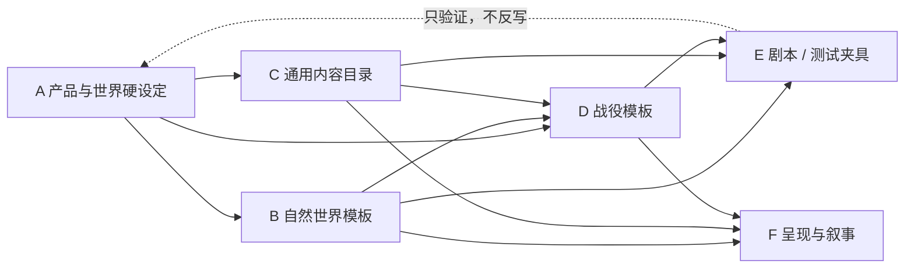

# Always Game：标准化与剧本分离规范

> **状态：已确认，优先级高于一切旧纵切与旧 Demo 文档。**
>
> 目的：本项目制作编年史和样例剧本，是为了补完世界、验证规则、提供内容方向；不是为了把“第 07 号—翡翠河谷”做成唯一游戏。本规范要求游戏内核、内容数据、地图、UI 与叙事样例彻底分层，任何地点都可被替换而不改动系统。
>
> 系统级对象、关系与实施顺序见 `SYSTEM_SKELETON_BLUEPRINT.md`；本文件只负责“剧本不能侵入系统”的边界。

## 1. 总原则

1. **系统先于剧本。** 玩家操作、数值结算、科技前置、工程选址、道路规划、地图生成和存档结构均不得依赖专名地点、固定人物或固定事件。
2. **世界观保留，开局实例可换。** “灾后类地行星”“统一中央政府”“从小型聚居共同体到全球统合再到群星”“连续挂机战略”是产品硬设定；第 07 号、翡翠河谷、旧渡口、井口听证只是旧样例。
3. **编年史提供锚点，不提供硬编码坐标。** 它规定某类能力、制度或冲突应在何种发展条件下出现；具体在哪个大陆、由哪个聚居点、以什么名称发生，由战役模板和种子决定。
4. **任何显示名都不是逻辑主键。** 名称、描述、旗帜、事件文案与贴图只读稳定 ID 和参数；不得反向驱动数值、选址或解锁。
5. **Demo 是测试夹具，不是默认正史。** 可以为了测试覆盖全部地形、资源和工程类型而创建特殊世界；该世界必须明确标注为测试夹具，且可一键重建、废弃，不进入主设定。

## 2. 必须分开的六层

| 层 | 回答的问题 | 可以包含 | 禁止包含 |
|---|---|---|---|
| A. 产品与世界硬设定 | 游戏是什么、玩家是谁 | 统一中央政府、灾后世界、时代方向、性能约束 | 固定开局地点、固定居民数、固定工程名 |
| B. 自然世界模板 | 这颗星球有什么自然条件 | 行星参数、种子、板块、气候、水文、生态、资源潜力、稳定地理格 | 城市名、道路、已建工程、剧情事件 |
| C. 通用内容目录 | 能力与行动有哪些 | 科技、工程模块、政策家族、事件原型、地标资产、地图模块 | “河谷专用”前置、某局坐标、固定角色台词 |
| D. 战役模板 | 这一局从什么发展条件开始 | 起始时代、人口/能力区间、初始解锁、已知范围、势力密度、胜负/阶段门 | 写死的世界种子和专名地点（除非明确作为可选剧本） |
| E. 剧本/测试夹具 | 用什么条件验证系统 | 固定种子、命名表、测试目标、人工插入的边界条件、截图验收 | 对 A/B/C 层的逻辑反向修改 |
| F. 呈现与叙事 | 玩家如何理解当前局 | 本地化名称、报告、地图标签、事件参数、资产选择 | 独立保存数值事实、直接修改模拟状态 |

**依赖方向只能从上到下：** A 约束 B/C/D，B/C/D 生成 E/F；E/F 不得反写 A/B/C。



## 3. 统一数据契约

下列是下周实现前应冻结的抽象接口。字段名可以调整，层级和职责不能合并。

```ts
WorldTemplate {
  id, generatorVersion, planetProfile, worldSeed,
  geographyRules, climateRules, ecologyRules
}

CampaignTemplate {
  id, eraId, startProfile, discoveryRules, factionRules,
  initialCapabilities, stageGates, contentPools
}

ScenarioFixture { // 可选；正式战役不必存在
  id, worldTemplateId, campaignTemplateId, fixedSeed?,
  testCoverage, injectedConditions, presentationPackId
}

SettlementSite {
  id, geoRef, role, suitability, discovered,
  settlementState? // 只有实际形成聚居地后才有
}

EngineeringSite {
  id, geoRef, moduleId, naturalRequirements, suitability,
  discovered, developmentState? // 被选择、勘察、开工后才有
}

NetworkProject {
  id, kind: 'road' | 'rail' | 'canal' | 'power' | 'water' | 'data',
  endpointA, endpointB, requiredCapabilities,
  routePlan?, constructionState?, builtEffectId?
}
```

### 3.1 ID、名称与参数

- **ID：** 只表达类型和关系，例如 `module.water_utility`、`tech.hydrology.survey_01`、`site.g5-1248`；不得含 `valley`、`07`、角色名或叙事事件名。
- **显示名：** 由 `presentationPack` 按世界/地区/文化/时代生成。名称可重复但 ID 不可重复。
- **关系：** 只引用 ID 或稳定 `GeoReference`；禁止引用屏幕坐标、贴图文件名和中文标题。
- **数值效果：** 写成能力、国家指标、风险权重、解锁条件和标准地图效果；不得写“给河谷 +10”之类的地点特判。
- **文案：** 读取 `copyKey + parameters`。例如“[地点] 的净水工程完成试运行”，而非在模拟代码中拼接完整句子。

### 3.2 世界节点与地理引用

自然世界只产生下列事实：地理格、海拔、气候、水文、资源潜力、自然风险，以及“适合聚居/适合某工程”的候选点。

| 对象 | 何时出现 | 数据来源 | 是否可改名 |
|---|---|---|---|
| 聚居候选点 | 世界生成 | 水源、地形、生态、可达性 | 是 |
| 实际聚居地 | 玩家/系统在候选点建立后 | 候选点 + 人口 + 工程 | 是 |
| 工程候选点 | 世界生成或勘察揭示 | 工程模块需求 + 自然条件 | 是 |
| 已建工程 | 达到工程里程碑后 | 项目状态 + 标准地图效果 | 是 |
| 道路/管线 | 端点确认并完成规划、施工后 | `NetworkProject` | 是 |
| 势力/行政区 | 社会与统合过程产生 | 人口、制度、控制、事件 | 是 |

## 4. 科技、工程、政策与编年史的标准化

### 4.1 科技

科技只描述可复用能力，不描述某一局的“解决方案”。

```ts
TechnologyNode {
  id, domain, tier, kind: 'trunk' | 'branch' | 'refinement',
  capabilityGrants, knowledgePrerequisites,
  infrastructurePrerequisites, unlocks, risks, copyKey
}
```

例：`tech.water.hydraulic_filtration` 给予“可验证过滤工艺”；它可解锁任意合格地点的净水工程，而不是“河谷净水续命”。

### 4.2 工程

工程目录只定义模块、条件、投入、阶段和效果。地点由本局 `EngineeringSite` 决定。

```ts
ProjectDefinition {
  id, moduleId, capabilityPrerequisites, siteRequirements,
  phases, metricEffects, networkNeeds?, mapEffectTemplate, copyKey
}
```

水务、农垦、矿场、港口、道路都遵循同一结构。道路不是一个固定连接线，而是 `NetworkProject`，其两个端点在玩家选择后才存在。

### 4.3 政策与国策

- 国策是跨地点的长期资源倾斜；不应出现“河谷优先”这类地点专用名称。
- 当前政策是短期、可指定对象的行政行动；其对象用标签或条件表达，如“新定居点”“水源受压地区”“危险通道”，不绑定一个地名。
- 编年史中的制度节点应转译为“可解锁的制度家族 / 触发条件 / 后果”，而非固定台词或固定日期事件。

## 5. 道路与网络规则（为后续路线试验冻结）

道路不是自然世界的装饰，也不是资源点生成后自动出现的最短线。

1. **端点建立：** 起点必须是已存在的聚居地、港口、物流枢纽或已建网络；终点必须是已决定开发的聚居地/工程/资源区。
2. **规划输入：** 球面格邻接、坡度、高程、水系、湿地、海陆、自然灾害、已建网络、技术能力和当前建设能力。
3. **规划输出：** 多条可解释方案，而非唯一“最优路”：长度、土方、桥渡、隧道、维护、运力、风险、施工期和前置能力。
4. **玩家决定：** 选择不建、暂缓、低标准便道、桥渡优先、绕行维护低、或高投入干线；中央国策会改变偏好但不代替选择。
5. **地图写入：** 只有勘察/施工/试运行/投用等真实里程碑才产生虚线、工地、通车线和能力效果。

## 6. 旧河谷纵切的定位与禁止事项

“第 07 号—翡翠河谷—旧渡口”从此统一称为 **Legacy Valley Fixture（旧河谷测试夹具）**：它可继续用于回归测试、文案样本和早期数值参考，但不再是默认战役或新系统的输入。

下列写法从下一次实现开始禁止新增：

- 在世界生成器、模拟器、渲染器中直接写 `河谷`、`翡翠`、`第 07 号`、`旧渡口` 或固定经纬度；
- 用 `facility_07`、`valley_outpost` 等旧 ID 作为科技、工程、地图或网络规则的前置；
- 由某个项目 ID 直接画某条固定道路、水管、城市形态；
- 因为故事需要而让不合格地点通过工程选址；
- 将样例人口、势力数量、初始资源、风险事件当作全局平衡基准。

允许保留的只有：世界的灾后背景、统一政府玩家视角、宏观发展节点、通用科技/工程逻辑，以及作为**单独 Fixture 数据包**的旧内容。

## 7. 当前耦合审计与拆解顺序

| 位置 | 当前问题 | 下周处理方式 |
|---|---|---|
| `src/v2/data.ts`、`state.ts`、`simulation*.ts` | 初始节点、人口、资源、事件和项目带有河谷专名 | 移入 `fixtures/legacy-valley/`；运行时改读 `CampaignTemplate` |
| `src/v2/worldBlueprint.ts`、`hydrology.ts` | 首局河谷流域、固定锚点与坐标参与世界生成 | 提取为 Fixture 的“指定世界条件”；通用生成器仅保证规则与覆盖率 |
| `src/v2/render/terrain.ts`、`planetMap.ts` | `WATER_NET`、`ROAD_NET`、山脊及工程渲染依赖固定路线 | 改由已建 `WorldEffectInstance` / `NetworkProject.routePlan` 绘制 |
| `src/v2/content/*` | 聚居地、设施、工程样例混有地点名 | 拆为通用 `module/catalog` 与旧夹具 `presentation pack` |
| `CORE_FRAMEWORK_BASELINE.md` 等旧纵切文档 | 把河谷当作默认可玩范围 | 只保留为历史测试说明，并在页首标注“非当前产品基线” |
| `GAME_SETTING_BIBLE.md`、早期 PRD/编年史 | 开局专名与世界硬设定混写 | 标注“世界硬设定 / 可选开局样例 / 编年史锚点”三种等级；不直接删除已有创作 |

## 8. 下周的实施门（顺序不可倒置）

1. **建立目录与类型：** 定义 `WorldTemplate`、`CampaignTemplate`、`ScenarioFixture`、`SettlementSite`、`EngineeringSite`、`NetworkProject` 的实际 TypeScript/JSON 契约。
2. **剥离旧夹具：** 把河谷节点、固定项目、事件文本、演示坐标和视觉命名迁到一个独立 Fixture 包；默认运行时不得 import 该包。
3. **生成通用测试战役：** 随机或可选种子生成多个聚居候选、工程候选和相邻势力条件；用标签与生成名显示，不使用河谷文本。
4. **接入道路规划器：** 仅在两个端点被确认后生成候选路线；先输出数据和黑白测试覆盖层，再做正式地图美术。
5. **重建 UI：** 在通用数据已稳定后再整理菜单、地图信息层和文案；旧河谷 UI 不能作为结构模板。
6. **最后才做平衡：** 用多种世界模板、不同开局条件和多条发展路线跑模拟，确认不是只对一个河谷样例有效。

## 9. 每次提交的验收问题

任何新系统、科技、工程、地图对象或事件进入代码前，必须回答：

1. 去掉所有显示名和剧情文本后，它还能运行吗？
2. 换一颗种子、地貌、文化命名表和起始设施后，它仍然成立吗？
3. 它引用的是自然事实、通用能力、战役状态，还是错误地引用了一个剧本 ID？
4. 它产生的地图变化能否由稳定地理引用和标准工程效果重建？
5. 它能否用至少两个不同行星/开局夹具验证？

五项中任一项为否，不得写进通用层；最多只能进入 Fixture。
