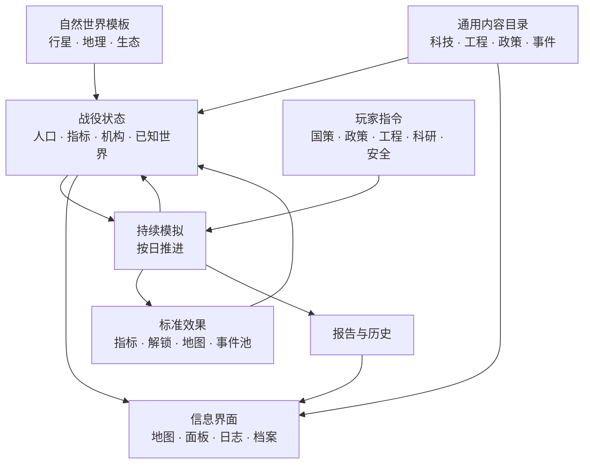

# Always Game：系统骨架总图

> **版本：v0.1｜状态：框架冻结，尚未整体实现。**
>
> 本文将“先建立骨架、再接内容与画面”的做法扩展到所有系统。它不替代 `STANDARDIZATION_AND_SCENARIO_SEPARATION.md` 的剧本分离边界；它规定后续 UI、科技、工程、数值、事件和测试怎样接到同一套通用系统上。

## 1. 总原则

- **先对象和关系，后名称和数值。** 先能表达任意科技、工程、地点、政策和事件，再填充首阶段的千级内容。
- **先最小闭环，后规模。** 每个系统先用少量通用样本证明“玩家输入—自动执行—可见反馈”闭环，再接入批量目录。
- **先事实层，后表现层。** 地图、面板、文本、贴图只能读取世界和战役事实，不能成为事实来源。
- **先多夹具验证，后平衡。** 同一规则至少在两种不同世界/开局条件下成立，不能只对旧河谷样例有效。
- **未实现必须明示。** 本文中的“已确认”可进入下游规格；“暂定”需试玩验证；不能把旧 Demo 行为误称为系统完成。

## 2. 总体关系



| 层 | 负责 | 禁止负责 |
|---|---|---|
| 自然世界 | 地理、生态、资源潜力、候选地点 | 人口、城市、道路、剧情结果 |
| 战役状态 | 实际聚居地、工程、科技、政策、指标 | 重写自然地形 |
| 内容目录 | 可用能力、项目、制度、事件原型 | 某一局的坐标、人物和地名 |
| 模拟 | 依规则更新战役状态 | 拼玩家文案、直接绘制 UI |
| 呈现 | 让玩家读懂事实和后果 | 决定数值、伪造地图事实 |
| 剧本夹具 | 验证一个条件组合 | 反向规定通用规则 |

## 3. 战役与模拟骨架

### 3.1 玩家指令（已确认）

玩家是单一中央政府的战略决策者，只操作六类高价值指令：

1. **国策**：长期资源倾斜；切换有组织惯性。
2. **当前政策**：有对象、有期限的局部行政行动；可随时替换但有代价。
3. **工程槽**：选择或自动推进实体项目。
4. **科研槽**：选择或自动推进能力节点。
5. **安全姿态**：防卫、护运、救援与风险容忍度。
6. **重大抉择**：只在真正改变路线的事件中出现，不把日常挂机切成回合。

玩家不直接分配居民、摆放建筑、画道路或操纵部队单位。

### 3.2 战役状态的八个域

| 域 | 最小对象 | 作用 |
|---|---|---|
| 时间 | 日、速度、离线时长 | 所有变化的统一尺度 |
| 国家 | 人口、核心指标、机构、安全姿态 | 中央当前可维持什么 |
| 地图 | 已知格、聚居地、工程点、网络、行政状态 | 事情在哪里发生 |
| 能力 | 已完成科技、能力标签、标准 | 社会能做什么 |
| 建设 | 项目槽、实际工程、里程碑、维护 | 正在形成什么实体 |
| 社会 | 人口流动、服务覆盖、风险、地方反馈 | 人承受什么后果 |
| 外部 | 势力、关系、威胁、协议与冲突 | 统一之外和统合之中发生什么 |
| 历史 | 事件、报告、完成档案、关键选择 | 提供可追溯解释 |

### 3.3 每日模拟顺序（已确认）

```text
读取指令与惯性
→ 更新生产、服务与维护能力
→ 更新人口、迁徙与社会压力
→ 推进工程与科研
→ 结算网络、地图和统合效果
→ 检查事件条件与阶段门
→ 写入少量重要报告/历史
→ 生成下一日可维持状态
```

每一步必须是可复现的纯数据计算：同种子、同初始状态、同指令序列得到同一结果。通知只是计算链的摘要，不能反过来改变结果。

## 4. 数值与经济骨架

### 4.1 九项长期核心指标（已确认）

| 指标域 | 玩家问题 | 常见来源 |
|---|---|---|
| 日常保障 | 人能否稳定活下去 | 水食、居住、医疗、基本服务 |
| 工务能力 | 能否维护和建设 | 工具、工人、标准、工场 |
| 可用能源 | 能否持续供能 | 发电、燃料、储能、负荷管理 |
| 研究能力 | 能否验证和复制知识 | 教育、实验、档案、人才 |
| 统筹能力 | 中央能否可靠执行决定 | 账目、机构、通信、预算 |
| 运输与补给 | 人和物能否抵达 | 道路、仓储、护运、网络 |
| 防卫能力 | 能否保护人民与公共资产 | 预警、训练、装备、救援 |
| 共同体协作 | 社会是否愿意共同承担 | 公平、服务、程序、信任 |
| 土地与环境 | 生产基础是否可持续 | 水土、污染、气候、修复 |

具体物资、矿种、滤材、武器、作物和零件不作为永久顶栏库存；它们是工程投入、设施维护、事件原因和区域特性，影响指标的**可维持水平、变化速度、风险或可用行动**。

### 4.2 统一单位（已确认）

- 聚居地阶段：1 LDU = 维持当前共同体一天的标准消耗。
- 国家阶段：1 NDU = 维持当前国家一天的标准消耗。
- UI 默认展示覆盖、缺口、趋势、储备时间和风险，而非无限增长的绝对吨数。
- LDU→NDU 是尺度变换，不能凭空增加产出。

### 4.3 标准效果（暂定）

每个科技、工程、政策和事件只能通过标准效果改变状态：改变指标可维持水平、改变调整速度、解锁能力、解锁内容、写入地图工程效果、改变风险权重、改变机构负荷、改变关系/统合状态。禁止“完成即永久 +1%”但没有生活、建设、风险或地图含义的效果。

## 5. 科技、工程与政策骨架

### 5.1 科技树（已确认）

- 玩家看到六类入口：生存与资源、工业能源基建、交通通信后勤、军事安全、社会治理、科学教育外拓。
- 内部按十个领域组织；每历史阶段至少 1,000 项科技：50 主干突破、750 路线分支、200 分级完善。
- 主干 = 首次实现新能力；分支 = 实现路线取舍；分级 = 可靠性、规模、安全或制度化。
- 50 项主干是有向无环图；下一层主干除本领域前置外，至少要求跨领域能力证明和已运行工程。
- 科技只赋予能力和解锁条件，不直接产生城市、道路或资源。

### 5.2 工程（已确认）

工程是形成实体结果的长期项目，不是政策或数值修正。每项工程都要经过：

```text
项目定义 → 所需能力 → 合格选址 → 勘察 → 施工 → 试运行 → 投用/维护
```

分类固定为聚居、农业/生态、工业/能源、公用设施、交通网络、知识/健康服务、防卫、港口/航天（按时代解锁）。项目定义引用通用模块，实际落点由该局的工程候选点决定。

### 5.3 政策与国策（已确认）

| 类别 | 时间尺度 | 留下地图实体 | 是否需要对象 |
|---|---|---:|---:|
| 国策 | 长期；可切换但有惯性 | 否 | 否，影响中央倾向 |
| 当前政策 | 有限期集中行政行动 | 否 | 是，按地区/人群/风险标签选择 |
| 工程 | 长期、一次性建设 | 是 | 是，必须有合格地点或网络端点 |
| 科研 | 长期、一次性能力验证 | 间接 | 是，引用能力/样本/已运行工程 |

每时代二十个政策是**政策家族**，必须随科技和工程升级为早期、成熟、制度化版本。

## 6. 地图、城市与网络骨架

### 6.1 自然地图（已确认）

行星参数 → 地壳/海盆 → 构造 → 水文 → 气候 → 生态资源 → 战役增量。稳定地理引用是所有地点、工程、网络与事件的共同坐标系。

### 6.2 人工地理对象（已确认）

| 对象 | 产生方式 | 可见变化 |
|---|---|---|
| 聚居候选 | 世界生成/勘察 | 可发展端点，不等于城市 |
| 实际聚居地 | 人口、设施与制度达到条件 | 规模、功能、服务与名称 |
| 工程候选 | 通用模块通过选址 | 工程可用性，不等于施工 |
| 已建工程 | 项目达到里程碑 | 地标、服务范围、网络节点 |
| 网络 | 两端点确认后规划并施工 | 道路、铁路、水网、电网、通信 |
| 行政状态 | 统合、服务与安全持续作用 | 边界、执行/协作/争议反馈 |

道路与其他网络必须以端点、路线方案、施工状态和维护状态组成独立对象；不能由地点名称或固定折线推导。

## 7. UI 信息架构骨架

### 7.1 一个主画面，六个入口（已确认）

地图是唯一常驻主舞台；其余内容以单一临时面板/抽屉打开，避免左、右、底反复出现“国家概览”。固定入口只有：

1. **国家**：人口、九项指标、机构与阶段门。
2. **国策与政策**：长期倾向、当前行动、切换代价。
3. **工程**：在建、可选、自动推进、已完成档案。
4. **研究**：分类科技树、当前研究、自动推进、已完成档案。
5. **防卫与外部**：安全态势、威胁、关系、行动许可。
6. **报告与历史**：重要完成、风险、因果报告、可查询档案。

顶栏固定显示时间/速度、人口和九项指标的可读摘要。点击任一指标必须能打开“来源、消耗、趋势、风险、下一影响”。

### 7.2 所有对象窗的字段（已确认）

```text
这是什么 → 当前状态 → 影响谁/哪里 → 正在发生什么
→ 下一里程碑或前置 → 代价/风险 → 可执行操作
```

不显示无操作意义的 AI 式长解释、内部术语、重复指标和未生效图层。

### 7.3 图层（暂定，需试玩验证）

基础地形、自然水系、已建聚居地和已建网络始终可见。政治与执行、人口与服务、基础设施、资源与环境、防卫与外部等叠加层必须各自回答一个不同问题；某层不能改变可读信息时，不得仅作为图例按钮保留。

## 8. 文案、视觉与资产骨架

- 模拟只输出状态键与参数；玩家文本由独立文案包生成，按 R6 的对象类型口吻书写。
- 地图视觉只读取自然地貌、气候、发展阶段、工程模块、施工阶段和显示密度。
- 城市是通用的气候/地貌/规模组合，不绑定河谷、设施编号或故事名。
- 地标资产只用于足够重要且能在战略尺度辨认的实体工程；普通工程累计改变城市形态。
- 远景、中景、近景读取同一份世界事实；缩放改变信息密度，不改变世界内容。

## 9. 测试与数据生产骨架

| 夹具 | 用途 | 不能替代 |
|---|---|---|
| 地理覆盖世界 | 覆盖海洋、山地、高原、河谷、森林、荒地、冻原 | 正式战役平衡 |
| 网络规划世界 | 多个聚居/工程端点与河流、山口、海岸障碍 | 默认故事地图 |
| 战役平衡世界 | 多路线、人口、风险、外部势力与阶段门 | 地形算法验收 |
| 叙事样例剧本 | 文案、事件和编年史锚点的阅读测试 | 通用规则 |

每项通用改动至少经过两个夹具：一个自然/空间夹具和一个战役/内容夹具。

批量生成一千科技、一千工程、二十政策之前，先冻结分类、ID、前置字段、效果类型、文案字段、地图模块与验证器；每条目必须通过无环、可达、跨领域、工程挂接、效果可见、文本样本审校六项检查。

## 10. 实施顺序

1. **S0 数据骨架**：落实世界模板、战役模板、剧本夹具、地点/工程/网络对象的 TypeScript 与 JSON 契约；旧河谷迁入 Fixture。
2. **S1 模拟骨架**：以通用对象替换固定项目、节点和事件，只接少量无专名样本。
3. **S2 空间网络**：用多端点测试世界完成道路/水网规划数据与黑白验证层。
4. **S3 内容骨架**：将 R5 科技—工程—政策图接入通用解锁器；先显示主干和少量样本。
5. **S4 UI 骨架**：按六入口和通用对象窗重构信息层，之后才处理视觉样式。
6. **S5 文案与美术**：以稳定 ID、参数和状态接入正式文案、城市与工程资产。
7. **S6 平衡与编年史**：用多世界、多路线模拟校正数值；将历史锚点接成条件化事件链。

## 11. 当前未完成项

- 通用战役模板、世界命名包和无河谷默认 Demo尚未实现；
- 道路规划器尚未实现，仅冻结端点和数据要求；
- 千级科技/工程目录尚未整体接入可玩循环；
- 六入口 UI 仅是信息架构，未重构现有界面；
- 九项指标正式公式、NDU 换算、战争/外交和长期人口社会模型仍需分系统细化。

这些空白不得由旧 Demo 行为或临时代码默认为既定规则。

